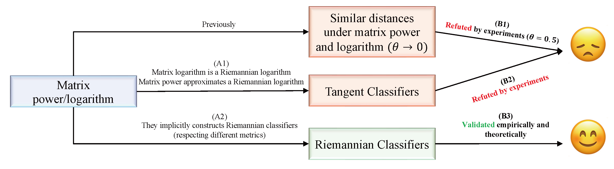
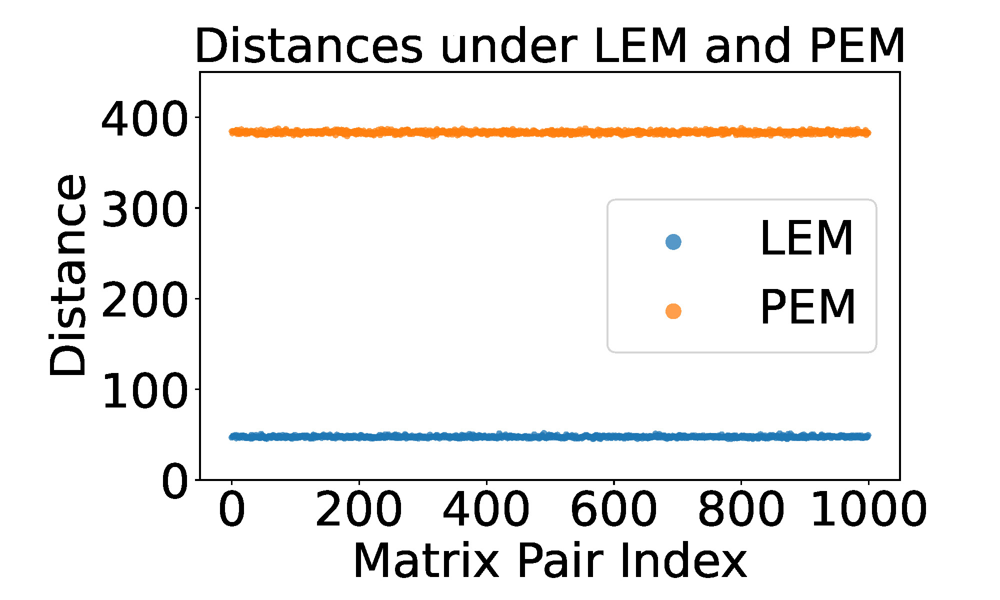
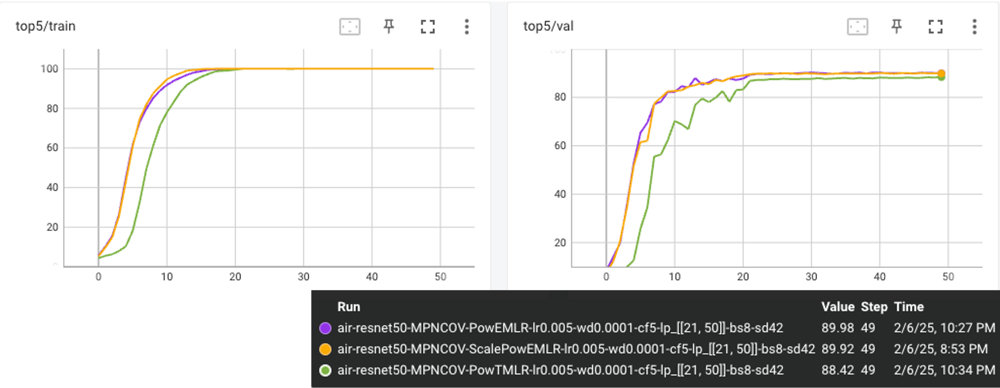
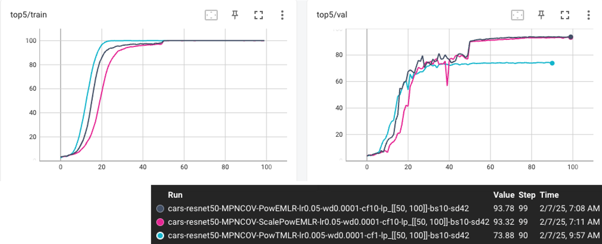

[</img>](https://arxiv.org/abs/2407.10484)
[</img>](https://openreview.net/forum?id=q1t0Lmvhty)
[</img>](https://openreview.net/pdf?id=q1t0Lmvhty)

# Understanding Matrix Function Normalizations in Covariance Pooling through the Lens of Riemannian Geometry

<div align="center">
    <figure>
        
        <figcaption>Figure 1: Illustration on the main postulations (A0 to A2) and empirical validations (B0 to B2).</figcaption>
    </figure>
</div>

<br><br>  <!-- Add spacing between figures -->

<p align="center">
    
</p>
<p align="center"><em>Figure 2: The distances under Power Euclidean Metric (PEM) and Log-Euclidean Metric (LEM) are significantly different (256 x 256 SPD matrices).</em></p>

## Introduction
This is the official code for our ICLR 2025 publication: *Understanding Matrix Function Normalizations in Covariance Pooling through the Lens of Riemannian Geometry*. 
For the first time, this work reveals that matrix functions in GCP implicitly respect Riemannian classifiers and explains the rationale behind using Euclidean classifiers on SPD matrices after applying the matrix power.

If you find this project helpful, please consider citing us as follows:
```bib
@inproceedings{chen2025riemgcp,
  title={Understanding Matrix Function Normalizations in Covariance Pooling through the Lens of {Riemannian} Geometry},
  author={Ziheng Chen and Yue Song and Xiaojun Wu and Gaowen Liu and Nicu Sebe},
  booktitle={The Thirteenth International Conference on Learning Representations},
  year={2025},
}
```
This code is based on [DifferentiableSVD](https://github.com/KingJamesSong/DifferentiableSVD) from
- Why approximate matrix square root outperforms accurate SVD in global covariance pooling? [[Paper](https://arxiv.org/abs/2105.02498)]

We also acknowledge [fast-MPN-COV](https://github.com/jiangtaoxie/fast-MPN-COV) from
- Towards Faster Training of Global Covariance Pooling Networks by Iterative Matrix Square Root Normalization. [[Paper](https://arxiv.org/abs/1712.01034)]

If you have any problem, please contact me via `ziheng_ch@163.com`.

## Implementation
Please check `requirements.txt` for the required packages.

For the preparation of three FGVC datasets, please refer to [fast-MPN-COV](https://github.com/jiangtaoxie/fast-MPN-COV).

## Experiments
`experiments.sh` contains all the scripts to compare Pow-EMLR, Pow-TMLR, and ScalePow-EMLR on three FGVC datasets (Tab. 5). 
You can either execute all the experiments using `bash` or run each Python script individually.
We also incorporate Chol-TMLR in `src/representation/LCMCOV.py`.

The tensorboard of the reproduced results are



